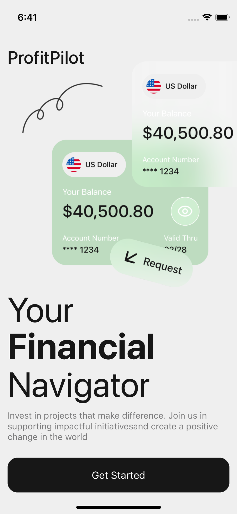
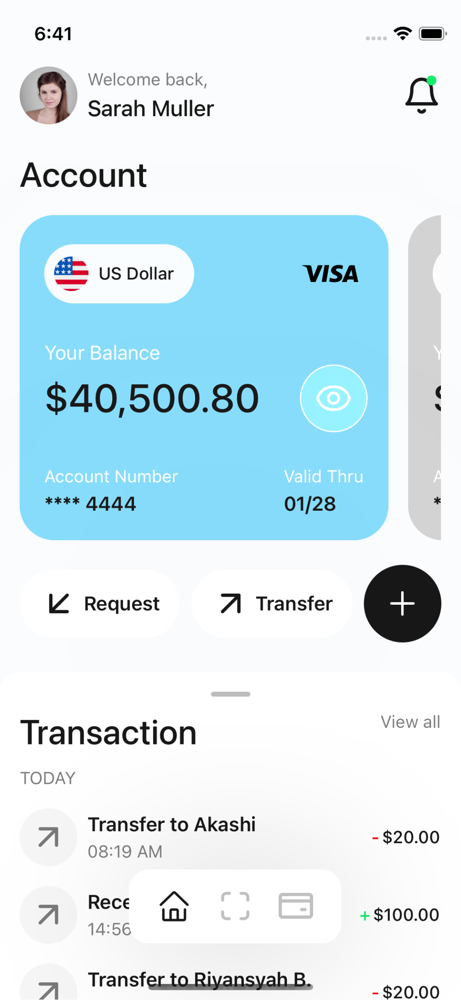
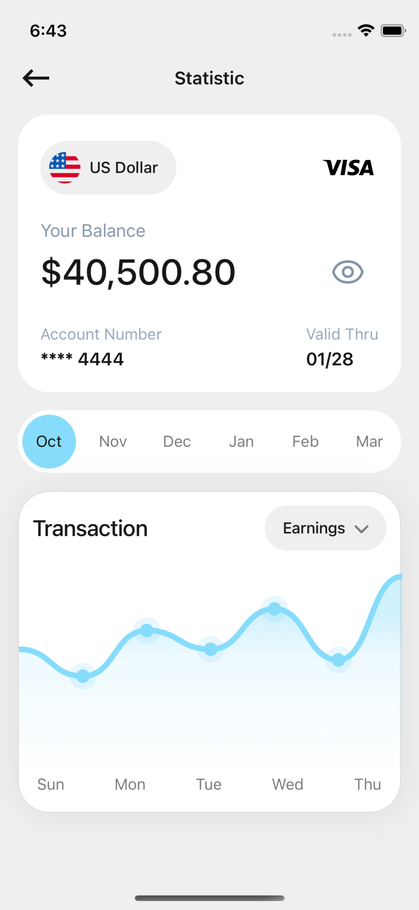
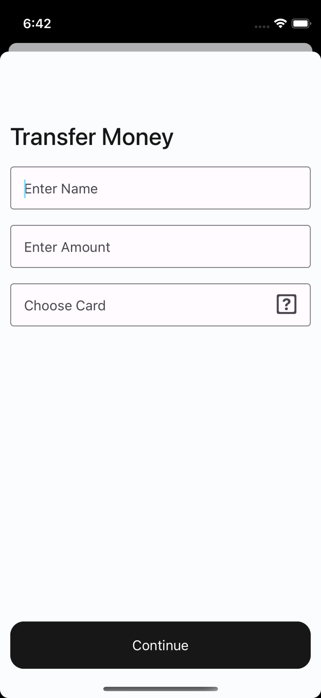
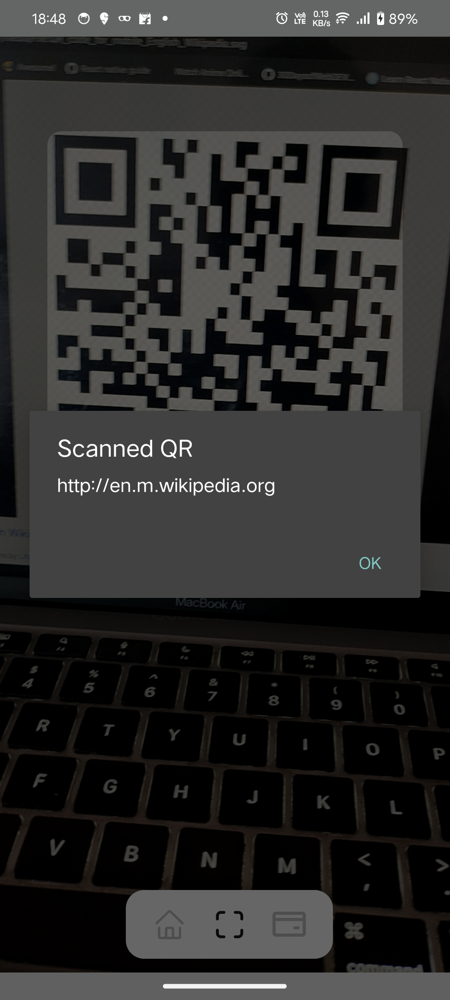
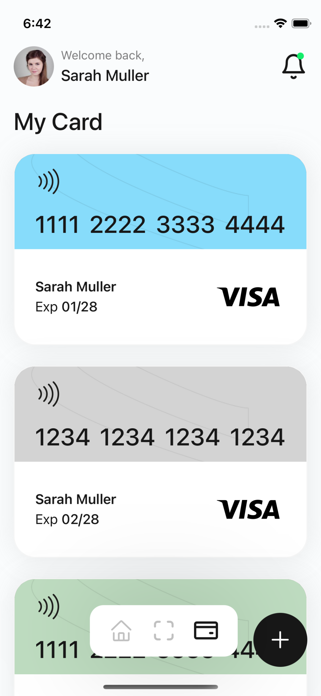

  
  <h1 align="center">ProfitPilot</h1>  

## :camera_flash: Demo

[Drive Link](https://drive.google.com/drive/folders/1nLC25bY79euCpukNGBTO-Yheqw09D7bz?usp=sharing)

## :camera_flash: Screenshots

 
 
